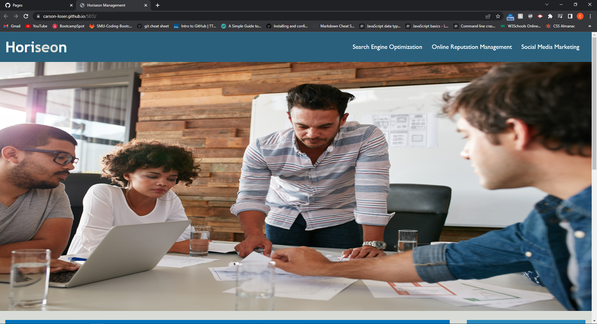

# Horiseon Management

#### By Carson Loser

#### This application provides an outlook on managing and marketing a business.

# Prerequisites and Dependencies

* Presence of HTML semantics.

* Structure must be logical and independent of styling and positioning.

* Must be accessible alt attributes on all images.

* Heading attributes fall into sequential order.

* Title is original and concise. 

# Live Server URL

- https://carson-loser.github.io/SEO/

# Assets

The following image demonstrates the web application's appearance and functionality:

